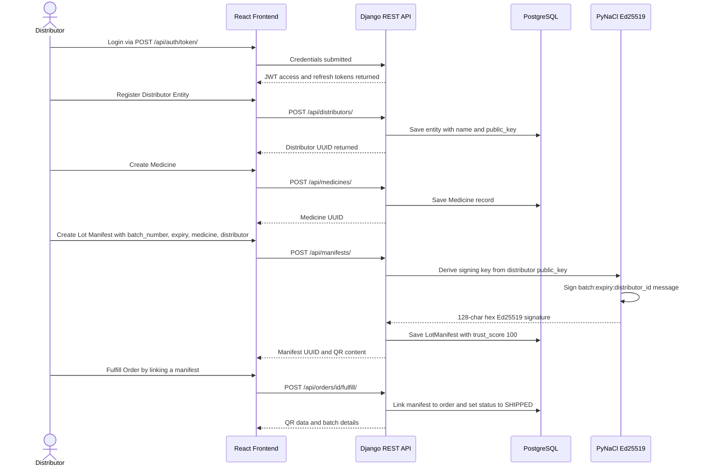
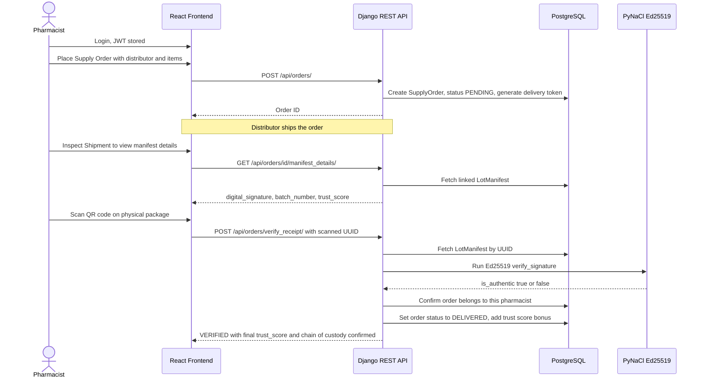
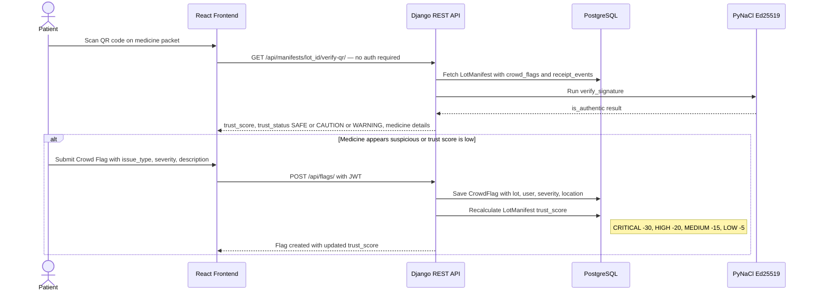
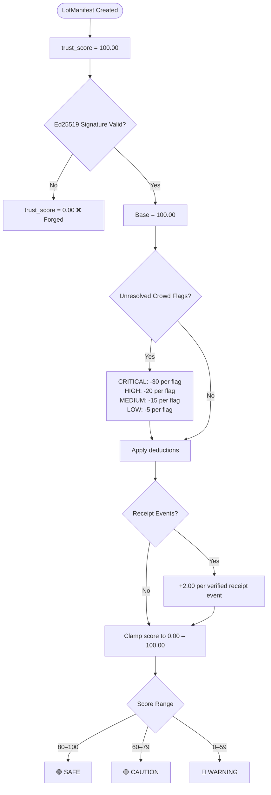

# RX-VERIFY

An industry-standard, secure pharmaceutical verification system designed to ensure the authenticity and safety of medicines across the supply chain. RX-Verify enables distributors to securely register drug manifests and empowers pharmacists and patients to verify authenticity, report flags, and combat counterfeit drugs.

## 🌟 Key Features

*   **Role-Based Access Control (RBAC):** Distinct workflows for Distributors, Pharmacists, Patients, and Administrators.
*   **Cryptographic Security:** Utilizes Ed25519 digital signatures to secure lot manifests, ensuring data integrity and non-repudiation without storing private keys on the server.
*   **QR Code Verification:** Automatically generates printable QR codes for lot manifests. Patients can scan these codes to instantly verify medication authenticity and view trust scores.
*   **Trust Score Engine:** Dynamic trust scoring based on verified receipts, crowd-sourced flags, and system-level alerts.
*   **Unified Dashboards:** Dedicated, responsive React dashboards for each user role to manage inventory, track orders, and report issues.

## 🛠️ Technology Stack

### Frontend
*   **Framework:** React 19 (Hooks, Functional Components)
*   **Build Tool:** Vite
*   **Language:** TypeScript
*   **Styling:** Tailwind CSS
*   **Routing:** React Router DOM v7
*   **Integrations:** JSQR, qrcode.react (QR code management), Axios

### Backend
*   **Framework:** Django 5.0
*   **API:** Django REST Framework (DRF)
*   **Database:** PostgreSQL (via psycopg2)
*   **Authentication:** JWT (djangorestframework-simplejwt)
*   **Cryptography:** PyNaCl (Ed25519 signatures), cryptography
*   **Documentation:** drf-spectacular (Swagger/OpenAPI 3.0)

## 📁 Project Structure

```text
RX-VERIFY/
├── RX-Verify-UI/       # React Frontend Application
│   ├── src/
│   │   ├── components/ # Reusable UI components and page views
│   │   ├── services/   # API abstraction layer
│   │   ├── hooks/      # Custom React hooks
│   │   └── index.css   # Tailwind configuration
│   └── package.json    # Frontend dependencies
│
└── backend/            # Django API Application
    ├── accounts/       # User management and RBAC
    ├── core/           # Main project settings
    ├── entities/       # Distributor and Regulator profiles
    ├── logs/           # Supply chain receipt events
    ├── manifests/      # Lot manifests and cryptography handling
    ├── orders/         # Distributor to Pharmacist orders
    ├── pharmaceuticals/# Medicine registry
    ├── reports/        # Crowd flags and anomaly reporting
    ├── manage.py       # Django CLI
    └── requirements.txt# Backend dependencies
```

## 🚀 Getting Started

### Prerequisites

*   Node.js (v18+)
*   Python (3.11+)
*   PostgreSQL running locally or remotely

### Backend Setup

1.  **Navigate to the backend directory:**
    ```bash
    cd backend
    ```
2.  **Create and activate a virtual environment:**
    ```bash
    python -m venv venv
    source venv/bin/activate  # On Windows use `venv\Scripts\activate`
    ```
3.  **Install dependencies:**
    ```bash
    pip install -r requirements.txt
    ```
4.  **Configure Environment Variables:** Create a `.env` file in the `backend` root with your database credentials and secret key.
5.  **Apply Migrations:**
    ```bash
    python manage.py migrate
    ```
6.  **Run the Server:**
    ```bash
    python manage.py runserver
    ```

### Frontend Setup

1.  **Navigate to the frontend directory:**
    ```bash
    cd RX-Verify-UI
    ```
2.  **Install dependencies:**
    ```bash
    npm install
    ```
3.  **Run the Development Server:**
    ```bash
    npm run dev
    ```

## 👥 User Roles & Workflows

*   **Distributor:** Registers medicine lots, completely handles digital cryptographic signing using private keys (never stored), and manages orders.
*   **Pharmacist:** Connects with distributors, orders inventory, scans received items to maintain the chain of custody, and reports discrepancies based strictly on physical inspections.
*   **Patient:** Public access user. Scans QR codes on medicine packaging to verify authenticity and submit crowd flags if they experience adverse reactions or suspect counterfeit drugs.
*   **Admin/Regulator:** Oversees the platform's overall operations, investigates severe anomaly flags, and maintains the centralized registry of verified entities.

## 🔁 Data Flow Architecture

The system has four primary data flows. Each flow is isolated by role and enforced at the API permission layer.

---

### 1. Distributor — Manifest Creation & Order Fulfillment



---

### 2. Pharmacist — Order Placement & Chain of Custody Verification



---

### 3. Patient — QR Code Verification & Crowd Flagging



---

### 4. Trust Score Engine



---

### API → Role Permission Matrix

| Endpoint | Patient | Pharmacist | Distributor | Admin |
|---|:---:|:---:|:---:|:---:|
| `GET /api/manifests/{id}/verify-qr/` | ✅ Public | ✅ | ✅ | ✅ |
| `POST /api/manifests/` | ❌ | ❌ | ✅ | ✅ |
| `POST /api/orders/` | ❌ | ✅ | ❌ | ✅ |
| `POST /api/orders/{id}/fulfill/` | ❌ | ❌ | ✅ | ✅ |
| `GET /api/orders/{id}/manifest_details/` | ❌ | ✅ (own) | ✅ (own entity) | ✅ |
| `POST /api/orders/verify_receipt/` | ❌ | ✅ | ❌ | ✅ |
| `POST /api/flags/` | ✅ | ✅ | ❌ | ✅ |
| `POST /api/manifests/{id}/verify/` | ❌ | ✅ | ❌ | ✅ |

## 📄 License

This project is licensed under the terms described in the `LICENSE` file.

