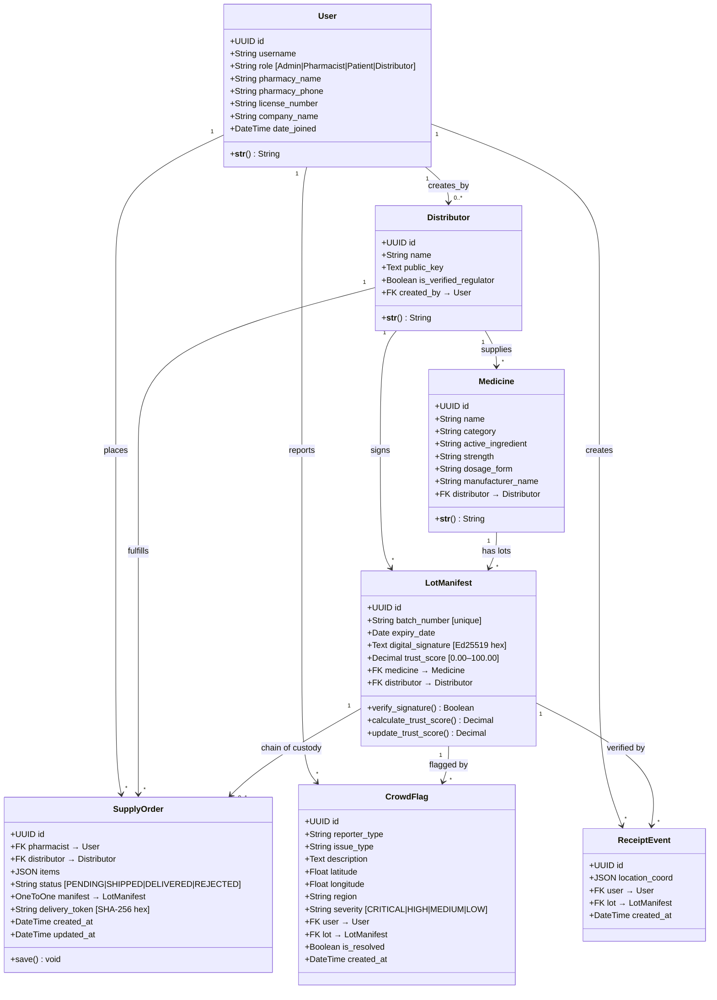
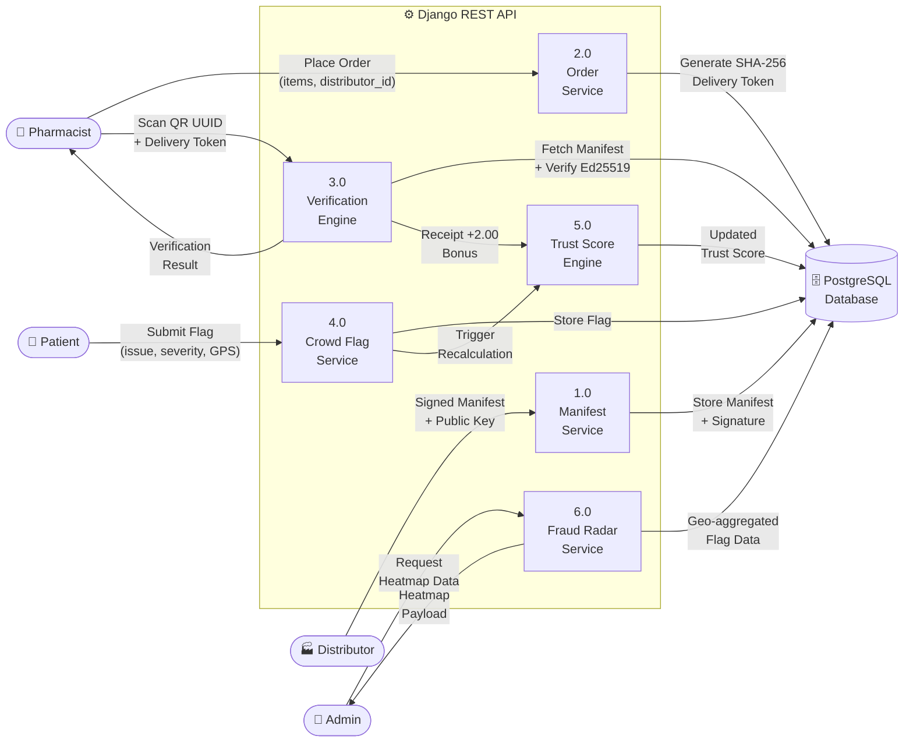
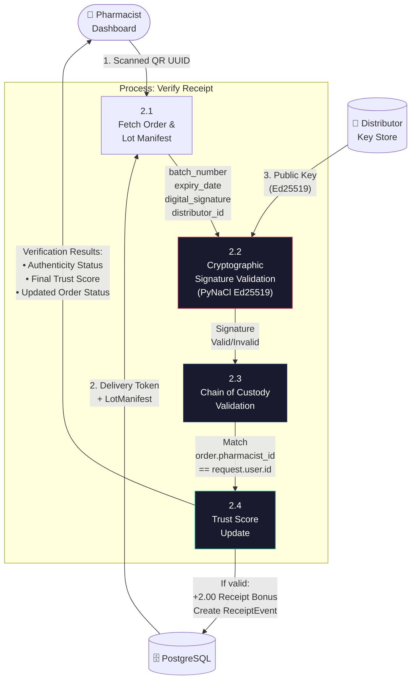
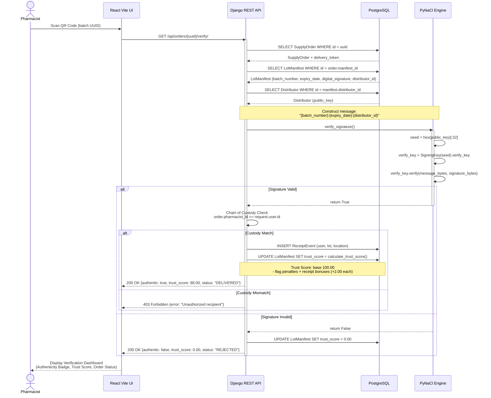
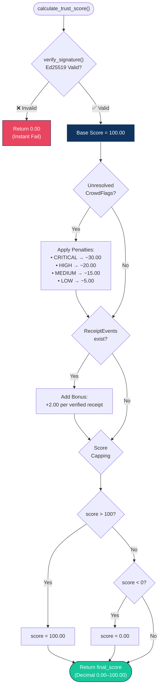

# RxVerify Lite — System Design Diagrams (Mermaid.js)

> **Usage:** Copy any `mermaid` code block below into your research document. These render natively in GitHub, Notion, Obsidian, and any Mermaid-compatible editor.

---

## 1. UML Use Case Diagram

```mermaid
flowchart TB
    subgraph RxVerify["🏥 RxVerify Lite System"]
        UC1["📦 Create Lot Manifest\n(Ed25519 Signed)"]
        UC2["💊 Register Medicine"]
        UC3["📋 Place Supply Order"]
        UC4["🔍 Verify Receipt\n(Scan QR / Batch)"]
        UC5["✅ Confirm Delivery\n(SHA-256 Token)"]
        UC6["🚩 Submit Crowd Flag"]
        UC7["📊 View Trust Score"]
        UC8["🗺️ Fraud Radar\n(Heatmap Dashboard)"]
        UC9["⚙️ Manage Users & Roles"]
        UC10["📈 Review Flagged Lots"]
    end

    Distributor(["🏭 Distributor"])
    Pharmacist(["💊 Pharmacist"])
    Patient(["🧑 Patient"])
    Admin(["🔐 Admin"])

    Distributor --> UC1
    Distributor --> UC2
    Pharmacist --> UC3
    Pharmacist --> UC4
    Pharmacist --> UC5
    Pharmacist --> UC7
    Patient --> UC6
    Patient --> UC7
    Admin --> UC8
    Admin --> UC9
    Admin --> UC10
    Admin --> UC7
```

---

## 2. UML Class Diagram

---

## 3. DFD Level 1 — System Overview

---

## 4. DFD Level 2 — Pharmacist Verification Process

### Sub-Process Details

| Sub-Process | Input | Logic | Output |
|---|---|---|---|
| **2.1 Fetch** | QR UUID | Lookup `SupplyOrder` + joined `LotManifest` | Manifest payload |
| **2.2 Crypto Validation** | `batch_number:expiry_date:distributor_id`, signature hex, public key | `nacl.signing.VerifyKey.verify(message, signature)` | `Boolean` (pass/fail) |
| **2.3 Chain of Custody** | `order.pharmacist_id`, `request.user.id` | Identity match assertion | `Boolean` (authorized/unauthorized) |
| **2.4 Trust Score Update** | validation results, existing `trust_score` | If valid → `+2.00`, create `ReceiptEvent`; if fail → score `0.00` | Final `Decimal` score |

---

## 5. UML Sequence Diagram — Pharmacist Verification Flow

---

## 6. Trust Score Algorithm — Decision Flowchart

